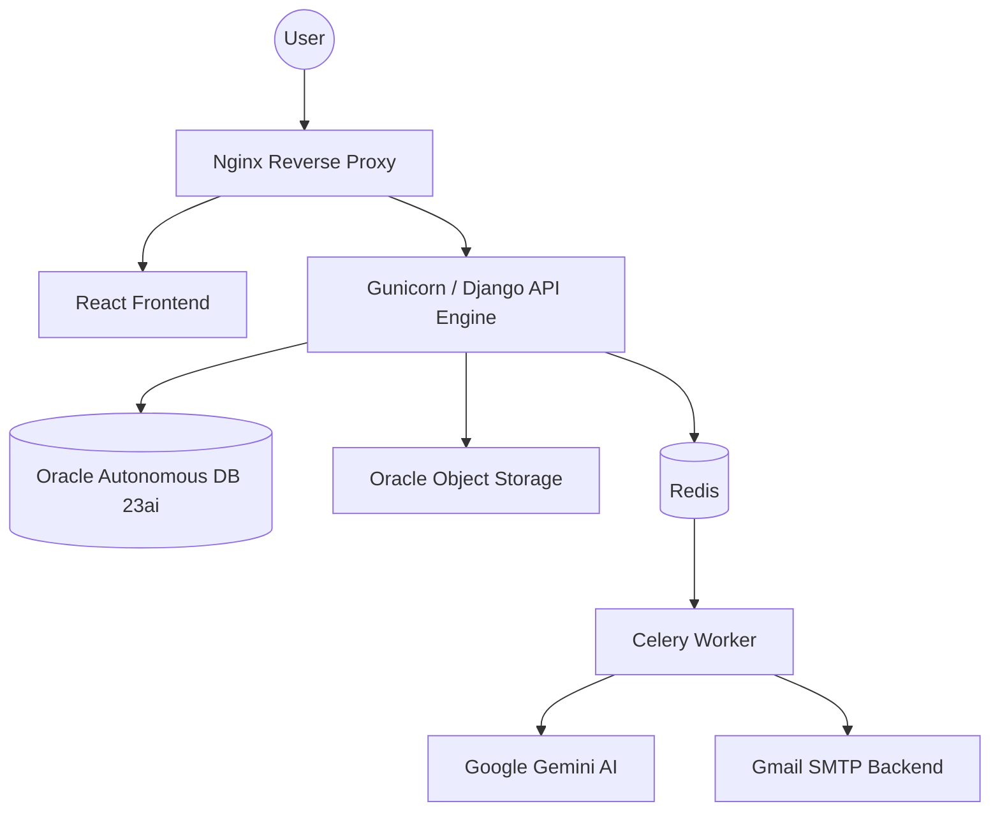

<div align="center">


# HireWix — Employee Management System (EMS)

**A professional, production-ready, multi-tenant SaaS HR platform built for modern companies.**

</div>

---

## 🌟 Overview

HireWix is a full-stack, multi-tenant Employee Management System engineered to streamline HR operations, simplify recruitment, and empower your workforce. Built natively for scale, this platform handles everything from candidate processing with AI to employee attendance, robust RBAC, and system-wide audits.

---

## 🏗️ Architecture & Tech Stack

HireWix leverages a robust, Hybrid Cloud Architecture providing extreme stability and maximum scaling potential.

- **Frontend:** React 19, TypeScript, Vite 6, Tailwind CSS.
- **Backend:** Django 4.2 REST Framework (DRF), Celery, Redis.
- **Database:** Oracle Autonomous Database 23ai (Fully managed, scalable cloud DB).
- **Object Storage:** Oracle Cloud Object Storage (S3-compatible, for passports, resumes, and assets).
- **Production Server:** Nginx Reverse Proxy \u0026 Gunicorn running on Oracle Cloud Infrastructure (Ubuntu VM).
- **Intelligence:** Google Gemini 2.5 Flash AI (Semantic parsing and ML integrations).
- **Payments:** Paystack / Flutterwave.

### Data Flow Overview


---

## 📂 File Structure

The project employs a clear separation of concerns between our frontend application and the backend Django engine.

```text
EMS---Employee-Management-System/
├── components/          # Reusable React components (UI forms, tables, modals)
├── context/             # React Context Providers for global state (Auth, Theme)
├── docs/                # Project documentation and architectural diagrams
├── ems-backend/         # 🐍 Django Backend API Root
│   ├── apps/            # Modular Django applications (core domains)
│   ├── config/          # Project settings, URL routing, and WSGI/ASGI apps
│   ├── scripts/         # Automated database seeding and migration utilities
│   └── tests/           # Backend unit and integration test suites
├── pages/               # React application views (Dashboard, Login, Profiles)
├── scripts/             # Useful bash/node scripts for automation
├── services/            # Frontend API clients mapping to Django endpoints
├── App.tsx              # Main React Application tree
├── index.html           # HTML Entry point
├── package.json         # Frontend dependencies and dev scripts
└── README.md            # You are here!
```

---

## ✅ What Has Been Achieved

Our platform currently hosts a powerful baseline of Enterprise-grade features:

### 🤖 Advanced ATS & Recruitment
- **AI Resume Parsing**: PDF analysis powered by Google Gemini, auto-extracting skills, education, and scoring candidates out of 100%.
- **Interactive Kanban Pipeline**: Drag-and-drop workflow (`Applied` -> `Hired` -> `Rejected`).
- **Dynamic AI Settings Panel**: Admins can securely hot-swap Gemini prompts and keys natively through the UI.

### 🏢 Core HR & Employee Portal
- **Self-Serve Dashboard**: Real-time attendance clock-ins, leave applications tracking, and intuitive monthly payslips display.
- **Multi-Tenant Security & RBAC**: A rigid `TenantManager` prevents cross-tenant data spillage. Roles strictly isolate admins, HR managers, employees, and applicants.
- **System-Wide Auditing**: A master Audit Log component that tracks every Create/Update/Delete mutation, IP, and diff history.

### 📊 Business Intelligence & Expansion
- **Interactive Org Chart**: Zoomable hierarchy tree defining reporting lines.
- **Document Management Engine**: Secure Oracle-backed passport and contract storage with 30-day automated expiration alerts via Celery.
- **SaaS Monetization**: Integrated billing (Paystack) determining seat-limits and workspace capability.
- **Rich Email Dispatcher**: Background-processing SMTP system orchestrating applicant welcomes, company announcements, and approval receipts.

### ☁️ Cloud & Infrastructure
- **Enterprise Database**: Fully migrated from local SQLite to Oracle Autonomous Database 23ai in the Johannesburg region, heavily optimized with custom JSONField compatibility patches.
- **Production Server Deployment**: Live deployment running on an Oracle Cloud Ubuntu VM, served via Nginx Reverse Proxy with Gunicorn handling the Django WSGI requests.
- **Background Task Processing**: Redis-backed Celery workers executing async events such as Google Gemini parsing and Gmail SMTP communications.

---

## 🚧 What Remains (Future Roadmap)

While HireWix is enterprise-ready, we are continuously driving it forward. Highlights from our roadmap include:

1. **Global Payroll & Compliance:** Real-money payout integrations (Stripe Connect/Wise) and automatic tax withholding engines across international regions.
2. **Advanced Performance Management:** Setting up 360-degree peer appraisals, hierarchical OKRs, and predicting flight-risk attrition through AI analysis.
3. **Immersive SSO & Tooling:** Adding SAML 2.0/Okta support and deeper integrations allowing employees to request PTO directly through Slack or Microsoft Teams.
4. **Mobile & Field Work PWA:** Location-fenced clock-ins (geofencing) and an offline-first mobile app for shift and warehouse workers.
5. **AI-Driven Predictive Staffing:** Leveraging seasonal data against the Gemini model to recommend department hiring sprints before gaps become critical.

*(For full details, please review our [Future Roadmap Document](./FUTURE_ROADMAP.md))*

---

## 🚀 Getting Started

To spin up the EMS stack locally:

### 1. Start the Frontend
```bash
npm install --legacy-peer-deps
npm run dev
```

### 2. Start the Backend Engine
```bash
cd ems-backend
pip install -r requirements.txt
python manage.py migrate
python manage.py runserver
```

*(Ensure you copy `.env.example` to `.env` in both the frontend and backend directories and populate your Oracle Cloud Database, Oracle Object Storage, Gmail SMTP, and Gemini credentials before attempting to start the server).*

---
<div align="center">
  Built with ❤️ · Powered by React, Django, Oracle Cloud, and Google Gemini AI
</div>
