<div align="center">


# Employee Management System (EMS)

**A modern, multi-tenant SaaS HR platform built for fast-growing companies.**

[](https://yourems.duckdns.org)
[](https://djangoproject.com)
[](https://reactjs.org)
[](https://cloud.oracle.com)

</div>

---

## 📋 Table of Contents

- [Overview](#-overview)
- [Live Screenshots](#-live-screenshots)
- [Features](#-features)
- [Architecture](#-architecture)
- [File Structure](#-file-structure)
- [Tech Stack](#-tech-stack)
- [Getting Started](#-getting-started)
- [Deployment](#-deployment)
- [Environment Variables](#-environment-variables)
- [API Reference](#-api-reference)

---

## 🌟 Overview

EMS is a full-stack, **multi-tenant** Employee Management System that allows any company to **register a workspace**, add employees, manage payroll, track attendance, handle leave requests, run hiring pipelines, and make company-wide announcements — all from a single, clean interface.

Built with a **SaaS-first architecture**, EMS supports complete isolation between companies (tenants). A dedicated **Host Command Center** allows the platform owner to monitor all registered organizations from a single super-admin panel.

### Key Design Principles

- 🏢 **Multi-Tenant Isolation** — Each company's data is fully isolated. No data leakage between tenants.
- 🔐 **Role-Based Access Control** — Four distinct roles: `HOST`, `ADMIN`, `HR_MANAGER`, `EMPLOYEE`, `APPLICANT`.
- 🤖 **AI-Powered Recruitment** — Google Gemini-powered resume parsing with automated candidate scoring.
- 📧 **Automated Email Notifications** — Event-driven emails via Brevo SMTP for leave, announcements, and hiring.
- 🚀 **CI/CD Deployment** — Automatic deploy to Oracle Cloud on every push to `main`.

---

## 📸 Live Screenshots

### 🔐 Login Page
> Secure, unified login for all roles — JWT authentication with role-based redirect.

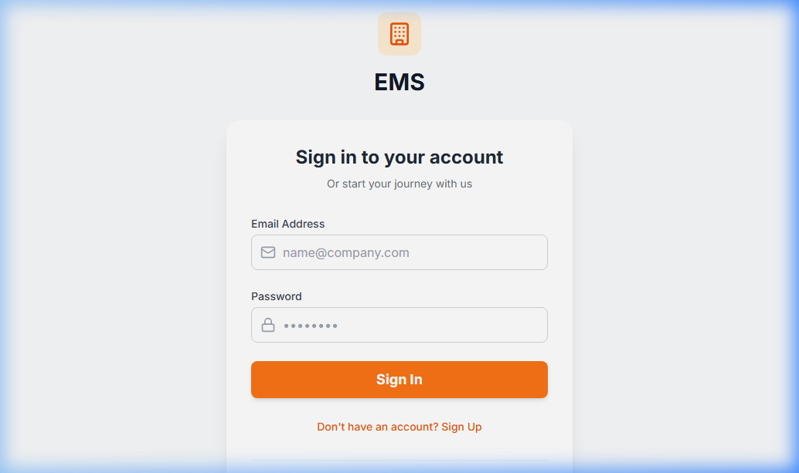

---

### 🏠 Landing Page
> Public SaaS landing page with company self-registration CTA.

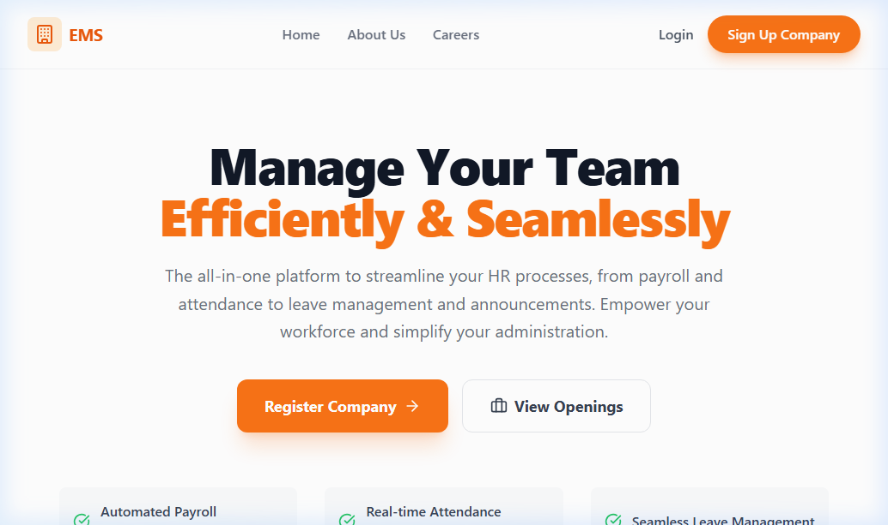

---

### 🏢 Admin Dashboard
> Central command for HR Admins — shows real-time KPIs: employees, attendance, leaves, payroll.

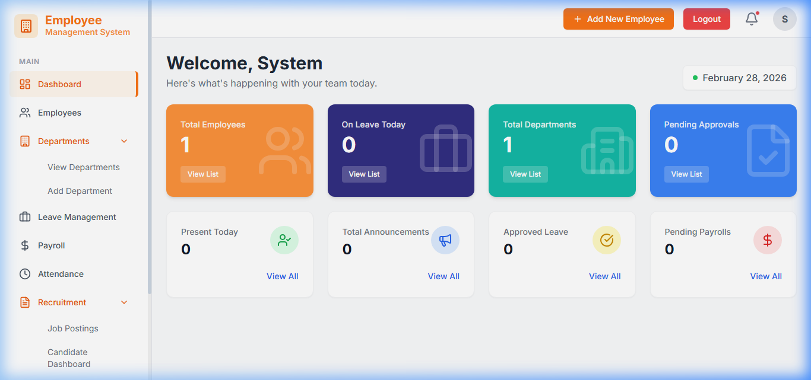

---

### 👤 Employee Portal
> Personalised self-service view — leave requests, payslips, attendance, and announcements.

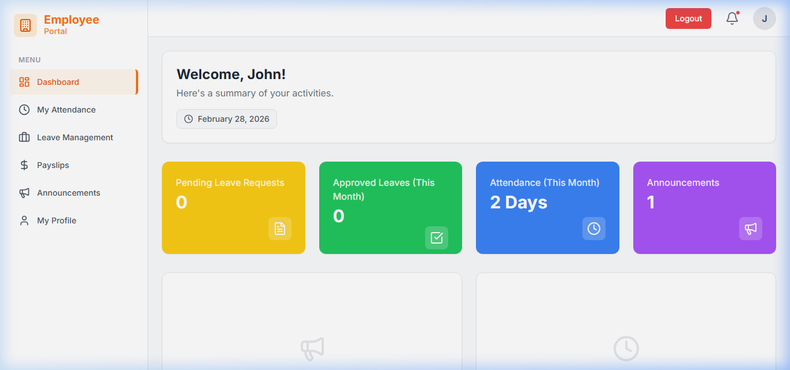

---

### 👤 Employee Profile
> Detailed employee profile with personal info, contact details, and role information.

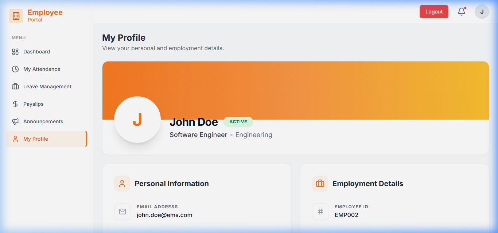

---

### 💰 Payroll Management
> Admin payroll management with payslip creation for each employee.

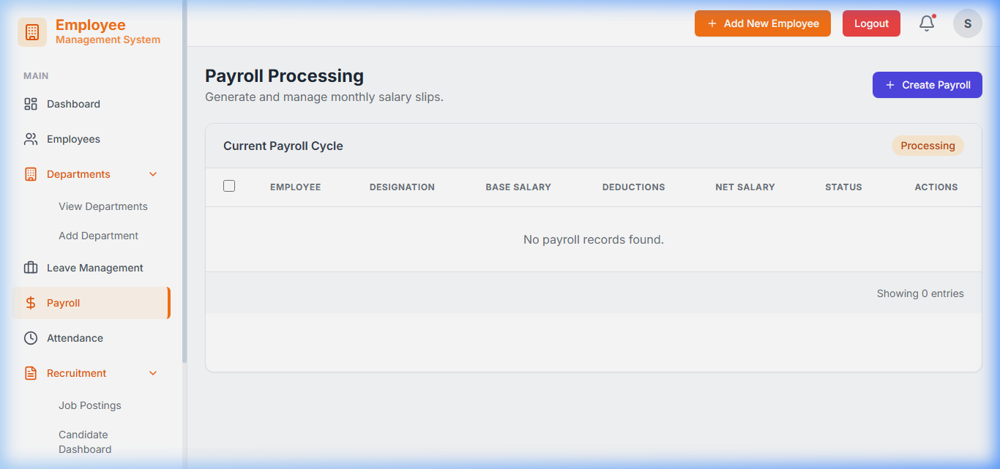

---

### 📢 Announcements
> Company-wide announcements — admin publishes, all employees receive email and in-app notification.

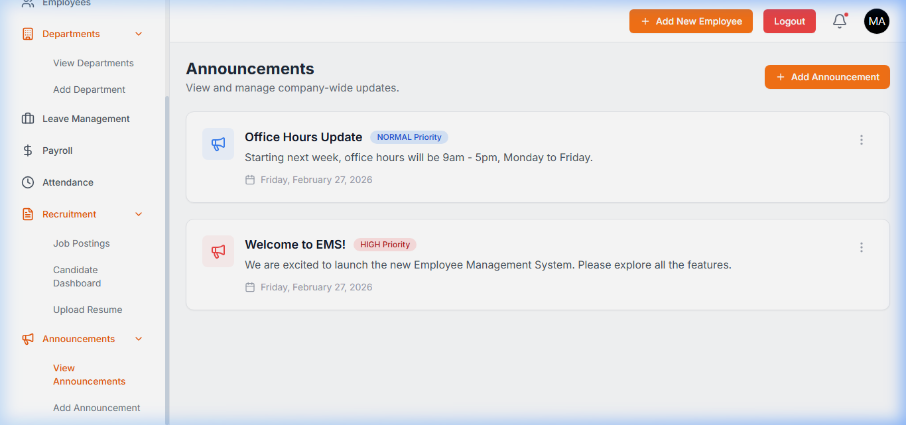

---

### 🛡️ Host Command Center
> Super-admin view to monitor and manage all registered companies on the platform.

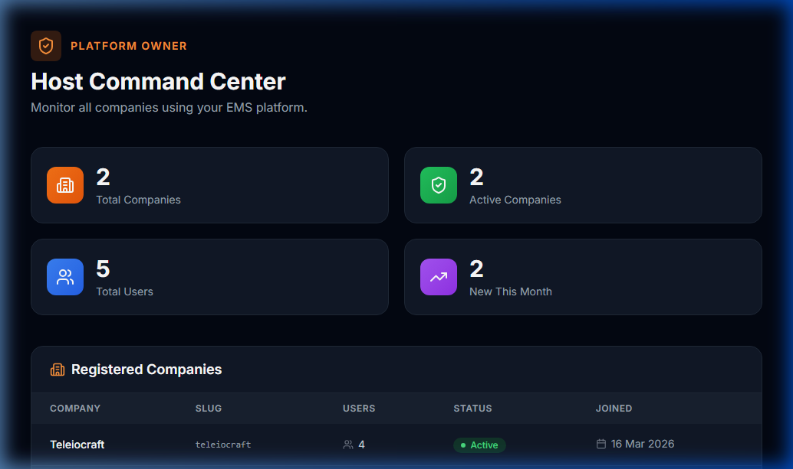

---

## ✨ Features

### 🔑 Authentication & Access Control

| Feature | Details |
|---|---|
| JWT Authentication | Stateless login via access + refresh token pair |
| Role-Based Routing | Separate dashboards and layouts per role |
| Multi-Factor Authentication | TOTP-based MFA with QR code setup |
| Tenant Context Middleware | Every API request is scoped to the authenticated user's company |
| Protected Routes | Frontend `ProtectedRoute` component guards every portal |

### 🏢 Multi-Tenant SaaS

| Feature | Details |
|---|---|
| Company Self-Registration | Any business can sign up and get a live workspace in seconds |
| Tenant Isolation | Middleware injects `request.tenant` — ViewSets filter all queries by it |
| Unique Slug | Each company gets a unique URL slug (e.g. `acme-corp`) |
| Tenant Status | Platform owner can suspend or reactivate individual companies |
| Welcome Email | Automated Brevo email sent to new company admin on registration |

### 👥 Employee Management

| Feature | Details |
|---|---|
| Add / Edit / Archive Employees | Full CRUD with profile photo upload |
| Department Assignment | Employees linked to custom departments |
| Employee Self-Service Profile | Employees can view and update their own profile |
| Role Promotion | Admins can change an employee's role (e.g., promote to HR Manager) |

### 📅 Attendance Tracking

| Feature | Details |
|---|---|
| Clock In / Clock Out | Timestamp-based attendance records per employee |
| Admin Attendance View | Filterable grid of all employee attendance per day/month |
| Monthly Summary | Aggregated attendance count per employee |
| Department Filter | Filter attendance by department |

### 🏖️ Leave Management

| Feature | Details |
|---|---|
| Leave Types | Configurable leave types (Annual, Sick, Maternity, etc.) |
| Leave Balance | Auto-initialised from `LeaveType.max_days_per_year` on first application |
| Business Day Calculation | Backend auto-calculates business days (excl. weekends) |
| Approval Workflow | Admin approves/rejects; employee receives email notification |
| Leave History | Full audit trail of all requests with status |

### 💰 Payroll Management

| Feature | Details |
|---|---|
| Payslip Generation | Admins create payslips with net/gross salary, tax, and deductions |
| Employee Payslip View | Employees see their own payslip history |
| Payroll Month Tracking | Payslips are tagged by month and year |
| PDF-ready Structure | Data is structured for easy PDF export (via ReportLab) |

### 📢 Announcements

| Feature | Details |
|---|---|
| Company-wide Announcements | Admins publish rich-text announcements to all employees |
| Broadcast Email | On publish, Brevo sends email to all active employees |
| Employee Feed | Employees see announcements in their portal |
| Edit / Delete | Full admin management of announcement lifecycle |

### 🎯 Recruitment Pipeline

| Feature | Details |
|---|---|
| Job Postings | Create, publish, and close job listings |
| **Public Careers Portal** | Each company gets a unique shareable link (`/careers/company-slug`) for external applicants |
| **Frictionless Apply** | Candidates can apply for jobs without needing an account; simply upload a resume |
| Resume Upload | Applicants upload CVs via secure portal (PDF) |
| AI Resume Parsing | Google Gemini flash model extracts skills, experience, and fit score automatically on upload |
| Kanban Candidate Board | Drag-and-drop (or click-to-move) candidates through stages: Applied → Shortlisted → Interviewing → Hired / Rejected |
| AI Fit Score Badge | Visual ring indicator showing AI match confidence percentage |
| Pipeline Email | Applicant receives an email on each stage change |
| **Applicant Dashboard** | Candidates can later log in to view their applications across *all* companies they've applied to |

### 🛡️ Host Command Center

| Feature | Details |
|---|---|
| Platform Stats | Total companies, active companies, total users, new signups this month |
| All Companies Grid | Table with name, slug, user count, status, and join date |
| Broadcast to All | Send platform-wide announcements across all tenants |
| Global User Search | Search any user across all companies by email or ID |
| Suspend / Reactivate | Toggle any company's active status |

### 📧 Email Notifications (via Brevo SMTP)

| Trigger | Recipients |
|---|---|
| Company Registration | New company admin |
| Leave Approved / Rejected | Applying employee |
| New Announcement Published | All active employees |
| New Job Posting | All active employees |
| Pipeline Stage Changed | Applicant |

---

## 🏗️ Architecture

### System Architecture

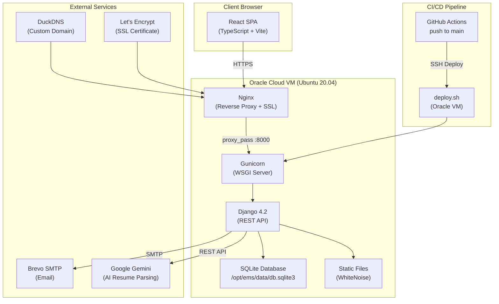

### Multi-Tenancy Architecture

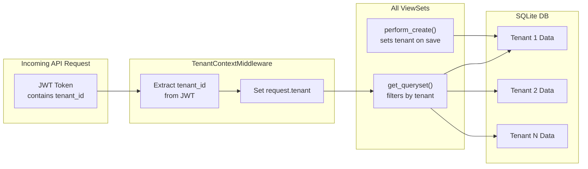

### Authentication & Role Flow

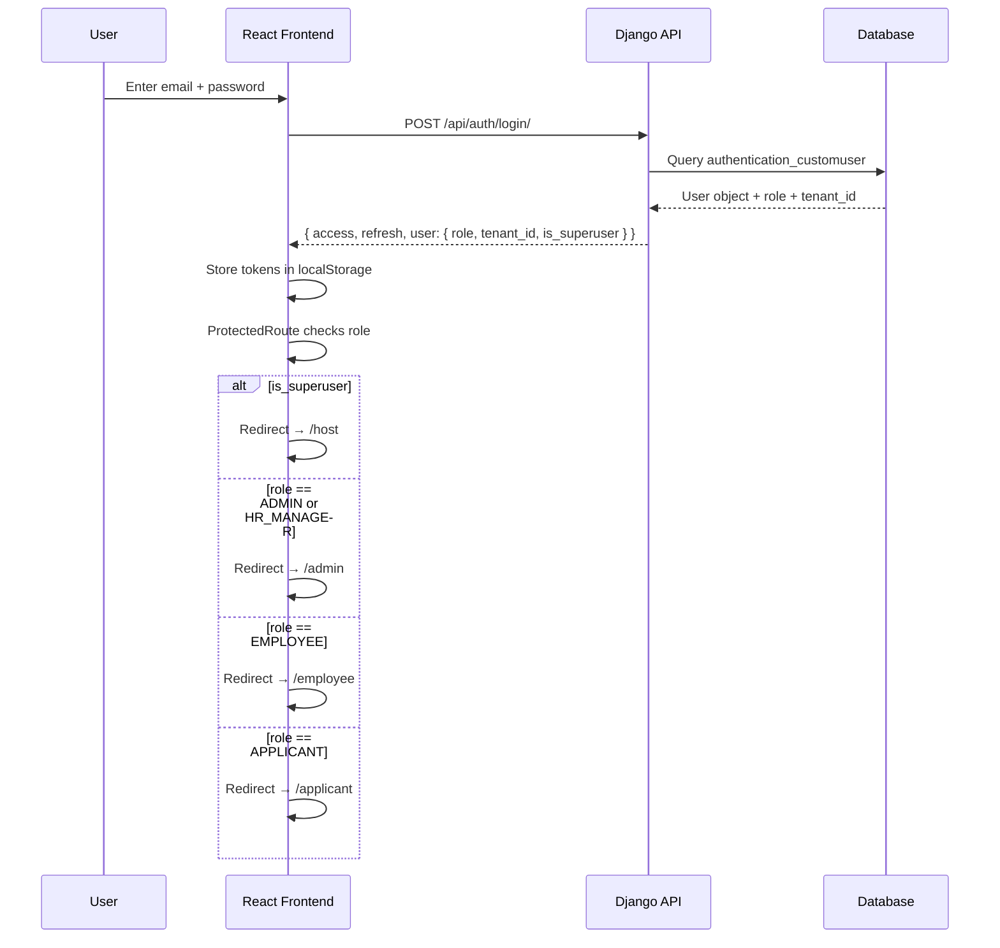

### Database Entity Relationships

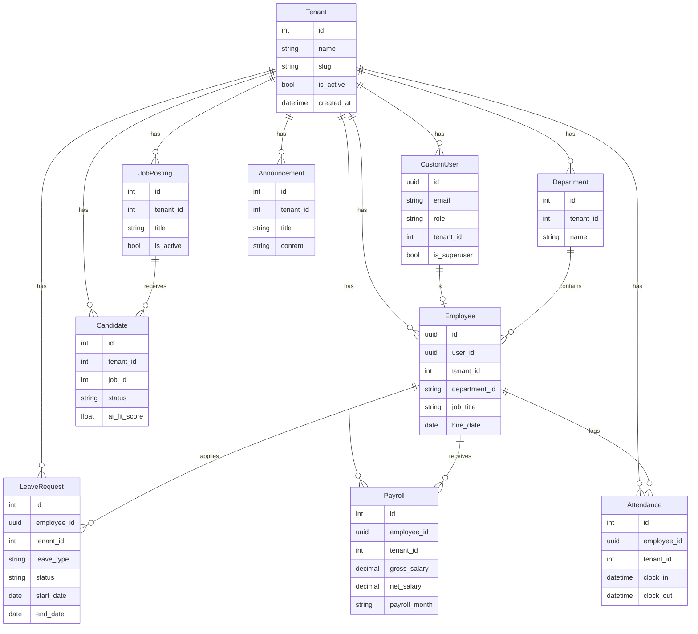

### Deployment Pipeline

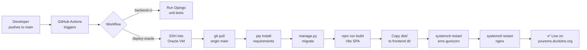

---

## 📁 File Structure

```
EMS---Employee-Management-System/
│
├── 📄 App.tsx                    # Root router — defines all 4 portal routes
├── 📄 index.tsx                  # React entry point
├── 📄 types.ts                   # Shared TypeScript types and enums
├── 📄 vite.config.ts             # Vite build configuration
├── 📄 deploy.sh                  # Full Oracle Cloud deployment script
│
├── 📁 pages/                     # All page-level components
│   ├── Landing.tsx               # Public marketing page
│   ├── Login.tsx                 # Unified login page
│   ├── CompanyRegister.tsx       # Self-service company signup
│   │
│   ├── 📁 host/
│   │   └── HostDashboard.tsx     # Platform owner command center
│   │
│   ├── Dashboard.tsx             # Admin dashboard with live KPIs
│   ├── Employees.tsx             # Employee list with search/filter
│   ├── AddEmployee.tsx           # Add/edit employee form
│   ├── Departments.tsx           # Department management
│   ├── AdminAttendance.tsx       # Full attendance grid view
│   ├── AdminLeaves.tsx           # Leave approval interface
│   ├── Payroll.tsx               # Payroll list view
│   ├── AddPayroll.tsx            # Create/edit payslip
│   ├── Announcements.tsx         # Shared announcement reader
│   ├── AddAnnouncement.tsx       # Announcement editor
│   │
│   ├── 📁 recruitment/
│   │   ├── JobList.tsx           # Job postings manager
│   │   ├── AddJob.tsx            # Job posting editor
│   │   ├── CandidateList.tsx     # Kanban pipeline board
│   │   ├── CandidateDetail.tsx   # Individual candidate profile
│   │   ├── UploadResume.tsx      # CV upload + AI parse trigger
│   │   └── AISettings.tsx        # Configure Gemini model settings
│   │
│   ├── EmployeeDashboard.tsx     # Employee home with personal stats
│   ├── EmployeeLeaves.tsx        # Apply for + view leave requests
│   ├── EmployeePayroll.tsx       # View own payslips
│   ├── EmployeeProfile.tsx       # Edit own profile
│   ├── Attendance.tsx            # Employee clock in/out
│   │
│   └── 📁 applicant/
│       ├── ApplicantDashboard.tsx # Applicant home
│       ├── JobBoard.tsx           # Browse open positions
│       └── ApplicantProfile.tsx   # Manage application profile
│
├── 📁 components/
│   ├── Layout.tsx                # Admin portal layout wrapper
│   ├── Sidebar.tsx               # Admin sidebar with tenant name
│   ├── EmployeeLayout.tsx        # Employee portal layout
│   ├── EmployeeSidebar.tsx       # Employee navigation
│   ├── ApplicantLayout.tsx       # Applicant portal layout
│   ├── ApplicantSidebar.tsx      # Applicant navigation
│   ├── Header.tsx                # Top navigation bar
│   ├── ProtectedRoute.tsx        # Role + superuser guard
│   └── 📁 recruitment/
│       └── CandidateCard.tsx     # Kanban card with AI score ring
│
├── 📁 services/                  # API client functions
│   ├── api.ts                    # Base axios instance + interceptors
│   ├── employeeApi.ts
│   ├── attendanceApi.ts
│   ├── leavesApi.ts
│   ├── payrollApi.ts
│   ├── recruitmentApi.ts
│   ├── announcementApi.ts
│   ├── applicantApi.ts
│   └── hostApi.ts
│
├── 📁 context/
│   └── ToastContext.tsx           # Global notification system
│
└── 📁 ems-backend/
    ├── 📁 ems_core/
    │   ├── settings/
    │   │   ├── base.py           # Shared settings
    │   │   ├── production.py     # Production overrides
    │   │   └── development.py    # Dev settings
    │   ├── middleware.py          # TenantContextMiddleware + IP whitelist
    │   ├── urls.py               # Root URL configuration
    │   └── wsgi.py               # WSGI entry point
    │
    └── 📁 apps/
        ├── 📁 authentication/    # CustomUser model, JWT, MFA
        ├── 📁 core/              # Tenant model, HostStats API, Company Registration
        ├── 📁 employees/         # Employee model, profile management
        ├── 📁 attendance/        # Clock in/out records
        ├── 📁 leaves/            # Leave types, balances, requests
        ├── 📁 payroll/           # Payslips and salary records
        └── 📁 recruitment/       # Jobs, candidates, AI parsing, AISettings
```

---

## 🛠️ Tech Stack

| Layer | Technology | Purpose |
|---|---|---|
| **Frontend Framework** | React 18 + TypeScript | SPA with type-safe component development |
| **Build Tool** | Vite 6 | Ultra-fast HMR and production bundling |
| **Routing** | React Router v7 (Hash) | Client-side routing with `#/` prefix for static hosting |
| **Styling** | Tailwind CSS | Utility-first styling with dark mode |
| **Icons** | Lucide React | Consistent icon library |
| **Backend Framework** | Django 4.2 | Robust ORM, admin, and middleware system |
| **REST API** | Django REST Framework 3.14 | Serializers, ViewSets, and router-based URLs |
| **Authentication** | DRF SimpleJWT 5.2 | Stateless JWT access + refresh tokens |
| **Database** | SQLite (prod) / PostgreSQL-ready | Lightweight production DB at `/opt/ems/data/db.sqlite3` |
| **Task Queue** | Celery 5.3 + Redis | Background email sending (non-blocking) |
| **Email** | Brevo SMTP | Transactional email delivery |
| **AI** | Google Gemini Flash | Resume parsing and candidate fit scoring |
| **PDF** | ReportLab | Payslip PDF generation |
| **API Docs** | drf-spectacular (OpenAPI 3) | Auto-generated API schema |
| **Web Server** | Gunicorn 20 + Nginx | Production WSGI server + reverse proxy |
| **SSL** | Let's Encrypt (Certbot) | Free HTTPS certificate |
| **Hosting** | Oracle Cloud Free Tier | Always-free Ubuntu 20.04 VM |
| **DNS** | DuckDNS | Free dynamic DNS for custom domain |
| **CI/CD** | GitHub Actions | Auto-deploy on push to `main` |

---

## 🚀 Getting Started

### Prerequisites

- Node.js `>= 18`
- Python `3.8+`
- Git

### Frontend (Local Dev)

```bash
# Clone the repository
git clone https://github.com/Teleiosite/EMS---Employee-Management-System.git
cd EMS---Employee-Management-System

# Install dependencies
npm install --legacy-peer-deps

# Start dev server
npm run dev
```

The app will be available at `http://localhost:5173`

### Backend (Local Dev)

```bash
cd ems-backend

# Create virtual environment
python -m venv venv
source venv/bin/activate   # Windows: venv\Scripts\activate

# Install dependencies
pip install -r requirements.txt

# Copy environment file
cp .env.example .env
# Edit .env with your values

# Run migrations
python manage.py migrate

# Create admin superuser
python manage.py createsuperuser

# Start dev server
python manage.py runserver
```

The API will be available at `http://localhost:8000/api/`

---

## 🌐 Deployment

EMS is deployed on **Oracle Cloud Free Tier** using an automated shell script.

### One-Command Deploy

SSH into your Oracle VM and run:

```bash
curl -o deploy.sh https://raw.githubusercontent.com/Teleiosite/EMS---Employee-Management-System/main/deploy.sh
bash deploy.sh
```

### Quick Deploy (Skip Dependencies)

```bash
cd /opt/ems
git pull origin main
bash deploy.sh --quick
```

### What `deploy.sh` Does

1. ✅ Installs system packages (Nginx, Node.js, Python, etc.)
2. ✅ Clones or pulls the latest code from GitHub
3. ✅ Installs Python dependencies into a virtualenv
4. ✅ Runs `manage.py migrate` — skips existing tables, never overwrites data
5. ✅ Builds the React frontend with Vite
6. ✅ Configures Nginx with SSL
7. ✅ Installs and starts `ems-gunicorn` as a systemd service
8. ✅ Verifies both services are running before exiting

---

## ⚙️ Environment Variables

Copy `ems-backend/.env.example` to `ems-backend/.env` on your server:

```env
# Django Core
DJANGO_SETTINGS_MODULE=ems_core.settings.production
SECRET_KEY=your-50-char-random-key
DEBUG=False
ALLOWED_HOSTS=your-server-ip,your-domain.com

# Database
DB_ENGINE=django.db.backends.sqlite3
DB_NAME=/opt/ems/data/db.sqlite3

# CORS
CORS_ALLOW_ALL_ORIGINS=False
CORS_ALLOWED_ORIGINS=https://your-domain.com
CSRF_TRUSTED_ORIGINS=https://your-domain.com

# Email (Brevo SMTP)
EMAIL_HOST_USER=your-email@gmail.com
EMAIL_HOST_PASSWORD=your-smtp-app-password
DEFAULT_FROM_EMAIL=your-email@gmail.com

# Celery (Background Tasks)
CELERY_TASK_ALWAYS_EAGER=True
CELERY_BROKER_URL=redis://localhost:6379/0
```

> ⚠️ **IMPORTANT:** `DJANGO_SETTINGS_MODULE` must always be set to `ems_core.settings.production` on your server. Without this, Gunicorn falls back to development settings with an empty in-memory database.

---

## 📡 API Reference

All API endpoints are prefixed with `/api/`. JWT Bearer token is required for all authenticated routes.

| Endpoint | Method | Description |
|---|---|---|
| `/api/auth/login/` | POST | Login — returns access + refresh tokens |
| `/api/auth/refresh/` | POST | Refresh access token |
| `/api/auth/register/` | POST | Register new company + admin user |
| `/api/employees/` | GET, POST | List or create employees |
| `/api/employees/{id}/` | GET, PUT, DELETE | Manage specific employee |
| `/api/departments/` | GET, POST | Department management |
| `/api/attendance/` | GET, POST | Attendance records |
| `/api/leaves/requests/` | GET, POST | Leave requests |
| `/api/leaves/requests/{id}/approve/` | POST | Approve a leave request |
| `/api/leaves/requests/{id}/reject/` | POST | Reject a leave request |
| `/api/payroll/payslips/` | GET, POST | Payslip management |
| `/api/recruitment/jobs/` | GET, POST | Job postings |
| `/api/recruitment/candidates/` | GET, POST | Candidates |
| `/api/recruitment/candidates/{id}/parse-resume/` | POST | Trigger AI resume parsing |
| `/api/core/host/stats/` | GET | Platform-wide statistics (superuser only) |
| `/api/core/tenants/` | GET | All registered companies (superuser only) |

> Full OpenAPI 3 documentation available at `/api/schema/swagger-ui/`

---

## 🔒 Security

- All API endpoints require JWT Bearer token authentication
- Tenant middleware enforces data isolation at the database query level
- `DEBUG=False` is enforced in production settings
- CORS is configured to only allow the production domain
- CSRF protection is enabled for all non-safe HTTP methods
- IP whitelisting support available via `IP_WHITELIST_ENABLED=True`
- SSL/TLS enforced via Let's Encrypt on all production traffic

---

## 📄 License

MIT License — see [LICENSE](./LICENSE) for details.

---

<div align="center">
  Built with ❤️ · Deployed on Oracle Cloud Free Tier
</div>