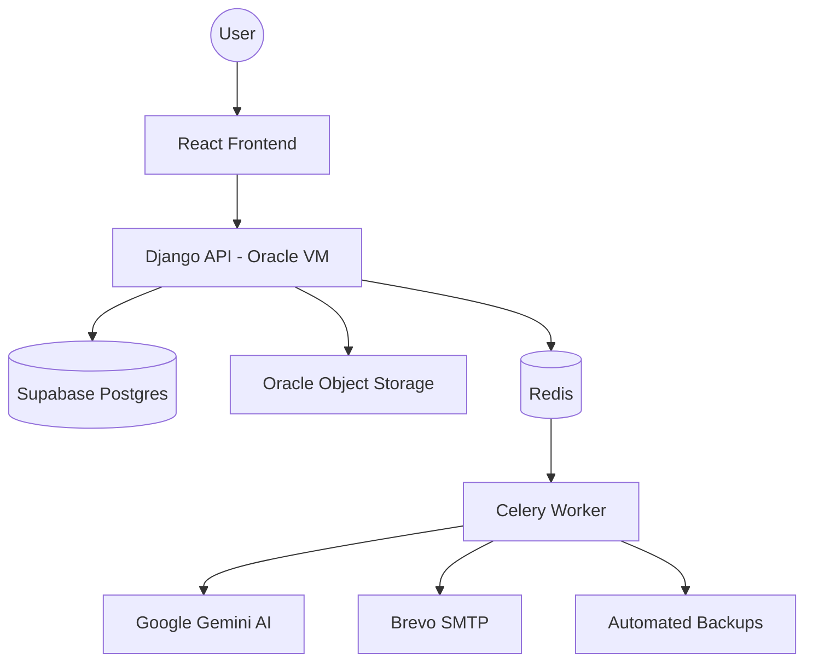

<div align="center">


# HireWix — Employee Management System (EMS)

**A production-ready, multi-tenant SaaS HR platform built for fast-growing companies.**

[](https://yourems.duckdns.org)
[](https://djangoproject.com)
[](https://reactjs.org)
[](https://supabase.com)
[](https://cloud.oracle.com)
[](https://ai.google.dev)

</div>

---

## 🌟 Overview

HireWix is a full-stack, **multi-tenant** Employee Management System that allows any company to **register a workspace**, add employees, manage payroll, track attendance, handle recruitment pipelines, and make company-wide announcements — all from a single, clean interface.

Built with a **Hybrid Cloud Architecture**, HireWix leverages the best-of-breed services for maximum stability and scale:
- 🏦 **Database**: Supabase PostgreSQL (Production-grade, high concurrency).
- 📦 **Storage**: Oracle Object Storage (Unlimited scale for heavy files & backups).
- 🤖 **Intelligence**: Google Gemini (Semantic resume parsing).

---

## 🆕 What's New — Tier 1 Enterprise Release

This release transforms HireWix into a market-leading SaaS with several advanced modules and **Interactive Admin Dashboards**:

### 📊 Business Intelligence & Transparency (NEW)
- **Interactive Org Chart**: Visualize your company's reporting lines with a dynamic, zoomable tree (built with `react-flow`).
- **Audit Log Dashboard**: A searchable security ledger for admins to track every data mutation, complete with JSON diffs and IP metadata.
- **Workforce Sentiment Insights**: Real-time analytics on employee happiness trends and survey engagement via visual charts (built with `recharts`).

### 💼 SaaS Monetization & Billing
- **Automated Billing**: Integrated **Paystack & Paystack Inline** for secure, automated subscription management.
- **Subscription Tiers**: Support for `Starter`, `Business`, and `Enterprise` tiers with automatic seat-limit enforcement (e.g., 25/100/Unlimited employees).
- **Real-time Status**: Dynamic usage tracking that prevents adding employees beyond your current plan limit.

### 🕵️‍♂️ Enterprise Foundation
- **Activity Tracking**: Every data mutation (`CREATE`, `UPDATE`, `DELETE`) is automatically logged via `AuditLogMiddleware`.
- **Org Hierarchy**: Recursive reporting lines (`reports_to`) fully supported in both Backend and Frontend forms.

### 📄 Document Management & Expiry Alerts
- **Secure Storage**: Dedicated module for storing Passports, Visas, and Contracts in **Oracle Object Storage**.
- **Automated Alerts**: A daily Celery task scans for documents expiring within 30 days and sends automated email alerts to HR admins.

---

## 🏗️ Architecture

### Hybrid Cloud Data Flow



---

## 🛠️ Tech Stack

- **Frontend**: React 19, TypeScript, Vite 6, Tailwind CSS.
- **Backend**: Django 4.2, DRF, Celery, Redis.
- **Cloud Infrastructure**:
  - **Compute**: Oracle Cloud Infrastructure (Always Free VM).
  - **Database**: Supabase (PostgreSQL).
  - **Storage**: Oracle Object Storage (S3-Compatible).
  - **Payments**: Paystack / Flutterwave.
  - **AI**: Google Gemini Flash.

---

## 🚀 Getting Started

```bash
# Frontend
npm install --legacy-peer-deps
npm run dev

# Backend
cd ems-backend
pip install -r requirements.txt
python manage.py migrate
python manage.py runserver
```

### 🔐 Environment Configuration
Copy the `.env.example` to `.env` and fill in your:
- `DB_HOST` (Supabase connection)
- `AWS_S3_ACCESS_KEY_ID` (Oracle OCI keys)
- `PAYSTACK_SECRET_KEY` (Billing)

---

## 🔐 Security & Compliance

| Measure | Implementation |
|---|---|
| **Field-Level Audit Logs** | Every sensitive change is tracked with IP and User metadata |
| **httpOnly JWT** | Secure token storage preventing XSS-based token theft |
| **Tenant Isolation** | Data isolation enforced at the middleware/ORM layer |
| **Hybrid Redundancy** | Critical data on Supabase; Large files & backups on Oracle |

---

## 🔮 Roadmap

Read our **[Future Roadmap & Vision Document](./FUTURE_ROADMAP.md)** for the next 20+ planned features including VR Onboarding and Blockchain Credentialing.

---

<div align="center">
  Built with ❤️ · Powered by Supabase, Oracle, and Google Gemini AI
</div>
